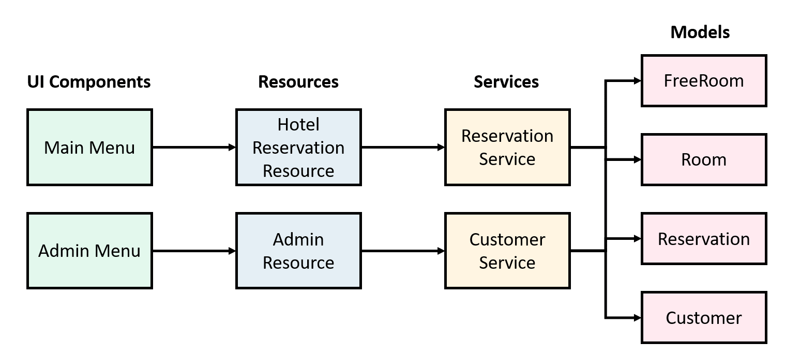

Application Architecture

1. User interface (UI), including a main menu for the users who want to book a room,
   and an admin menu for administrative functions
2. Resources will act as our Application Programming Interface (API) to our UI
3. Services will communicate with our resources, and each other, to build the business
   logic necessary to provide feedback to our UI
4. Data models will be used to represent the domain that we're using within the system

